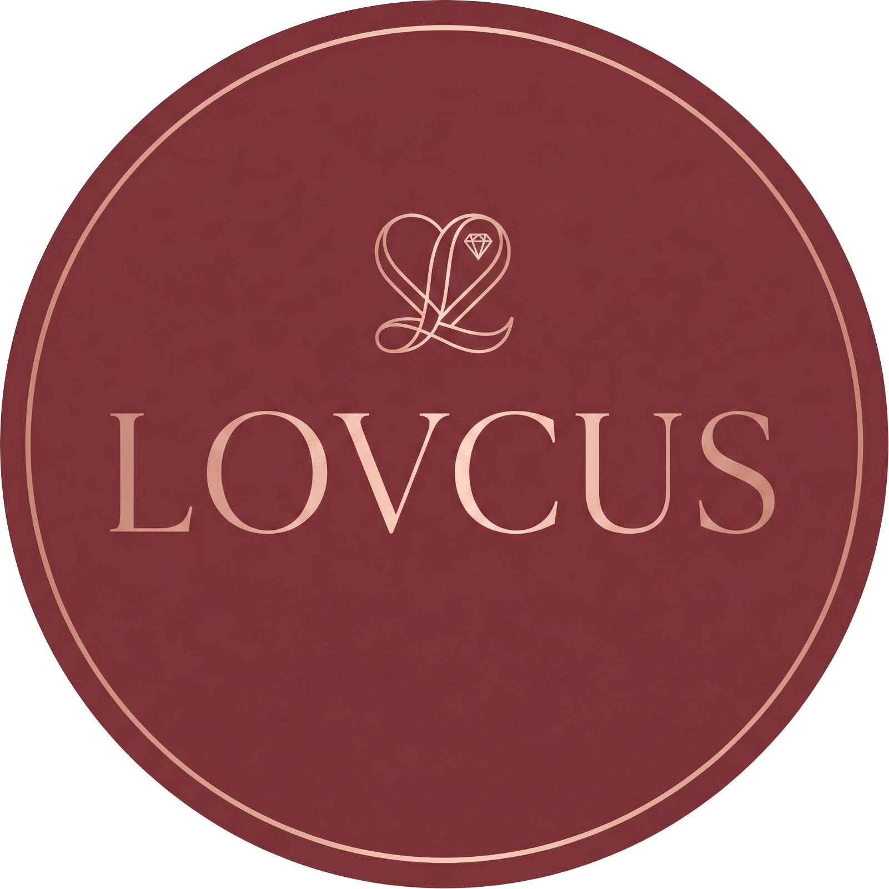

<div align="center">
  
  <h1>LOVCUS</h1>
  <p><strong>"Made with Love"</strong></p>

  <p>
    <a href="https://lovcus.store"></a>
    <a href="https://github.com/mustafa-shah-tech/LOVCUS"></a>
    <a href="https://app.netlify.com/sites/lovcus/deploys"></a>
    <a href="https://opensource.org/licenses/MIT"></a>
  </p>
</div>

---

## 📖 About
LOVCUS is a premier handmade jewelry brand based in Malakand, KPK, Pakistan. We specialize in crafting customized bracelets, friendship bands, and full jewelry sets. Every piece is created by family artisans with care, turning emotions into beautiful, wearable memories.

## 🔗 Live Demo
Visit our live store: [**https://lovcus.store**](https://lovcus.store)

## 📸 Screenshots
<!-- Add screenshots here -->

## 🛠️ Tech Stack

| Technology | Description |
| :--- | :--- |
| **HTML5** | Semantic structure and SEO |
| **CSS3** | Vanilla CSS styling (No frameworks) |
| **Vanilla JS** | Core logic, shopping cart, DOM manipulation |
| **Supabase** | Backend database for orders and reviews |
| **Chart.js** | Analytics charting for the Admin Dashboard |
| **Netlify** | Fast, secure edge hosting and continuous deployment |
| **Google Analytics** | Traffic tracking and user insights |

## ✨ Features
- 🛍️ **Handmade Product Catalog**: Browse 11+ beautifully crafted jewelry pieces.
- 🔍 **Category Filter & Search**: Easily find products by type (bracelet, custom bracelet, full set) or name.
- 🛒 **Persistent Shopping Cart**: State preserved via `localStorage` for a smooth shopping experience.
- 💬 **WhatsApp Checkout**: Seamless, direct order placement integrated with WhatsApp.
- ⭐ **Customer Review System**: Powered by a live Supabase database for authenticated feedback.
- 🔐 **Admin Panel**: Role-based (Super Admin & Admin) secure dashboard for store management.
- 📈 **Sales Analytics Dashboard**: Visualize store performance, revenue, and top-selling products.
- 📦 **Order Tracker**: Keep track of customized orders and inventory status.
- 🚀 **SEO Optimized**: Fully equipped with meta tags, Open Graph, JSON-LD schema, and XML sitemap.
- 🛡️ **Netlify Security Headers**: Robust Content-Security-Policy and anti-clickjacking headers.
- 📱 **Mobile Responsive**: Flawless experience across desktops, tablets, and smartphones.

## 📂 File Structure
```text
lovcus/
├── index.html          # Homepage
├── shop.html           # All products
├── product.html        # Single product detail page
├── about.html          # Brand story
├── contact.html        # Contact info
├── policy.html         # Payment & delivery policy
├── admin.html          # Admin panel (password protected)
├── script.js           # All JavaScript logic
├── style.css           # All styles
├── sitemap.xml         # SEO sitemap
├── _headers            # Netlify security headers
├── CNAME               # Custom domain config
└── images/             # All product and brand images
```

## 🔐 Admin Panel
LOVCUS features a fully functional, password-protected Admin Panel located at `/admin.html`. 
It utilizes a secure role system (Super Admin and standard Admin) to manage operations. Store owners can review incoming orders, moderate customer reviews, manage product categories, and view detailed sales analytics without needing to touch the codebase.

## 🔎 SEO
The project is built with a strong focus on Search Engine Optimization to drive organic traffic. This includes:
- **Semantic HTML** structure.
- **Dynamic Canonical URLs** to prevent duplicate content issues.
- **Open Graph tags** for rich social media sharing.
- **JSON-LD Schema** for local store optimization.
- **`sitemap.xml`** optimized for search engines.

## 🚀 Deployment
This static site is hosted on [Netlify](https://netlify.com). Deployment is fully automated. Simply push any changes to the GitHub `main` branch, and Netlify will automatically trigger a build and deploy the updates to the live server.

## 📞 Connect With Us
We love hearing from our community! Follow us or get in touch:
- **WhatsApp**: [+92 327 0880908](https://wa.me/923270880908)
- **Email**: [lovcus.store@gmail.com](mailto:lovcus.store@gmail.com)
- **Instagram**: [@lovcus5432](https://www.instagram.com/lovcus5432?igsh=MTUya2x4ajdoNzhhdQ==)
- **Facebook**: [LOVCUS Page](https://www.facebook.com/share/18Fku7dqFf/)
- **TikTok**: [@lovcus5](https://www.tiktok.com/@lovcus5?_r=1&_t=ZS-936596nmzV2)
- **Location**: Malakand, KPK, Pakistan

## 📄 License
This project is licensed under the **MIT License**.
